# Boxing Writeup

## Forensics

### 钓鱼邮件

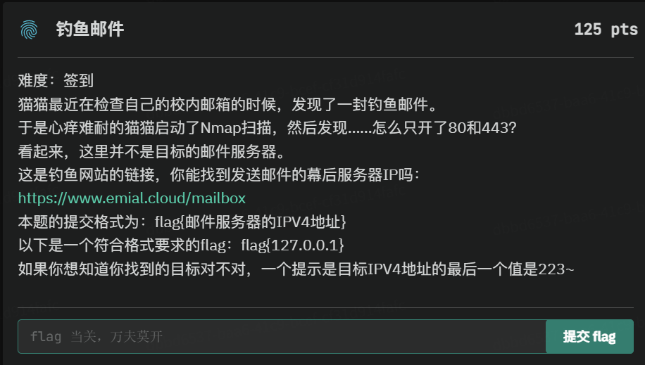

题目给出一个钓鱼网站链接，要求找到发送邮件的幕后服务器 IPv4 地址。

思路：
1. 钓鱼域名：emial.cloud（故意拼错 email） 
2. 查该域名 MX 邮件记录，得到邮件服务器
smtp.emial.cloud 
3. 解析其 IPv4 地址：39.109.116.223 
4. 末段 223 完全符合题目提示 
5. 按格式 `flag{xxxxxx}` 完善得到 flag。

```text
flag{39.109.116.223}
```

### 瘟疫公司 

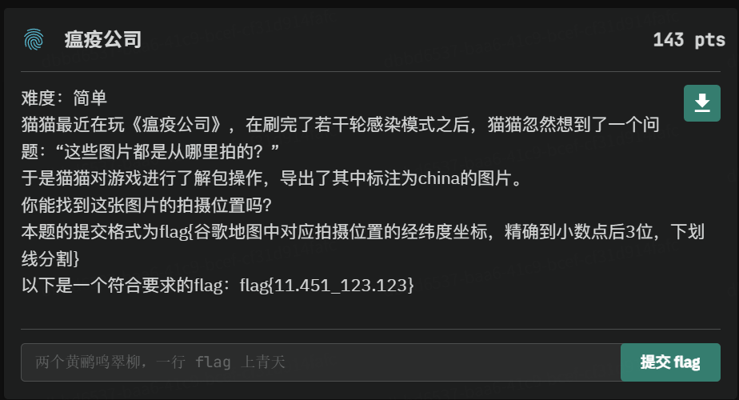

思路：
1. 通过查询相关资料，发现出题人坏的很咧（不是坏
话 emmm），因为此地点并不在 china，而是在东京
皇居外苑 
1. 此时打开谷歌地图（要科学上网），兴致勃勃地搜
索此地点 

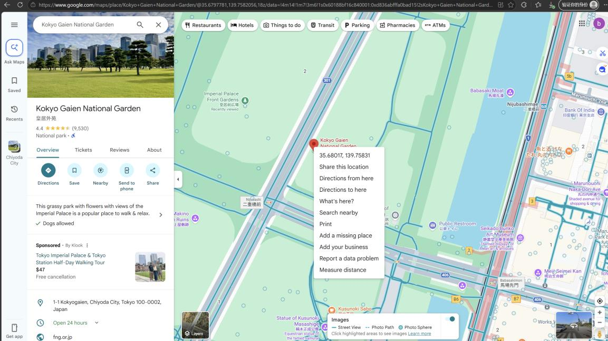


1. 发现经纬度，又兴致勃勃地按格式输入 flag，发现
不对我去（出题人坏的很嘞 X2），这是为什么呢？ 
1. 咱再仔细看看实际图和提供的图片的差别


5.仔细对比后发现差别，中间的马路与两条马路之间
的绿植，此时需要耐心在地点周围根据谷歌地图的
3D 展示，路灯也是提示之一，发现如下图 

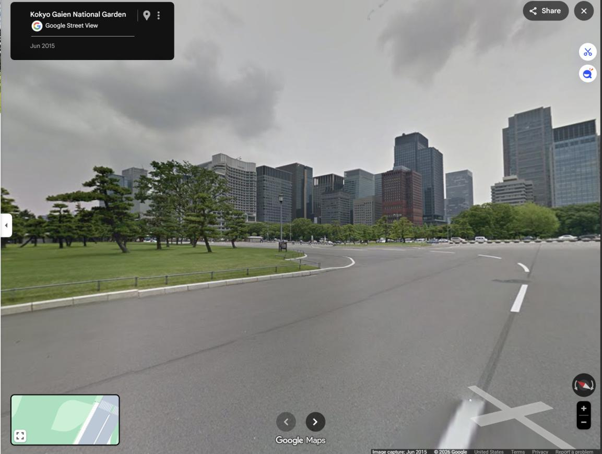
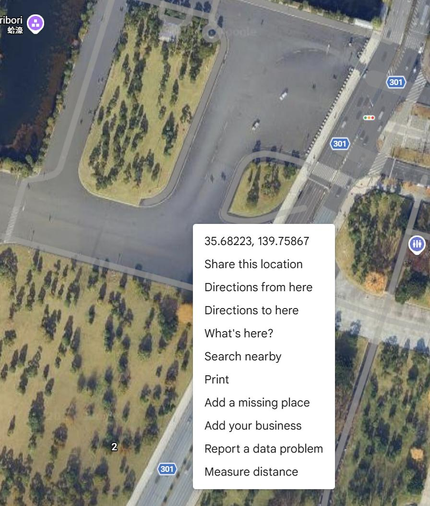

6.发现完全符合，找到经纬度。

```text
flag{35.682_139.758}
```

### 盒武器

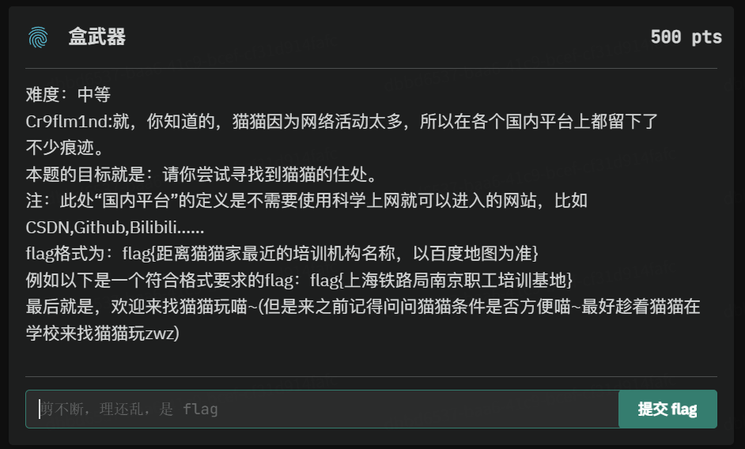

思路：1、根据提示，找遍 Cryflmind 的社交平台来寻
找蛛丝马迹，发现 Cryflmind 曾就读于界首市第一小
学，这是大概的一个位置，然后继续耐心查找，发现
Cryflmind 曾发布一张照片并评论在拍摄地点为家门口
附件，根据图片定位至鑫鑫名烟名酒店，根据地图可
发现周围有小区，在周边搜索培训关键词，然后耐心
尝试，本人尝试半个小时左右，将 1km 误差内的机构
名均尝试，最后得到正确地点为铂玛流行声乐春之声
声乐艺术培训，即 flag 为 flag{铂玛流行声乐春之声声
乐艺术培训} 

```text
flag{铂玛流行声乐春之声声乐艺术培训}
```

### 问卷调查

思路：填写问卷即可得到 flag 

## Hardware 

### 啊？我修 CPU？ 

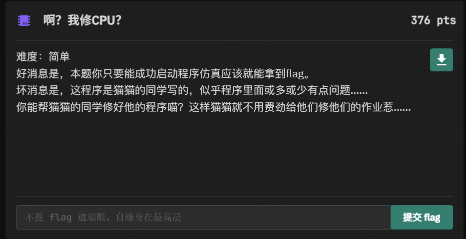

思路：1、下载附件后发现是 Vivado 文件 

2、按理说应该打开附件通过 Vivado 处理，可是由于
未知原因，本人无法正常运行程序，无奈只能一个一个查看文件夹，不看不知道，看了吓一跳，文件夹 
P14.ip_user_files 中有一文件为 flag.txt 

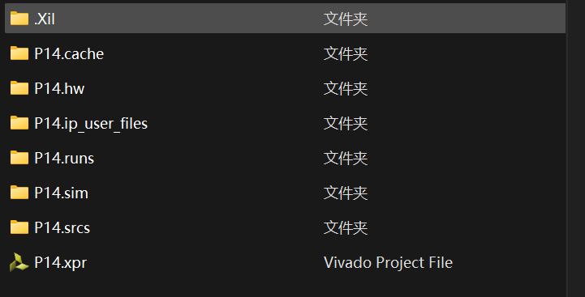


3、打开发现一大串数字 

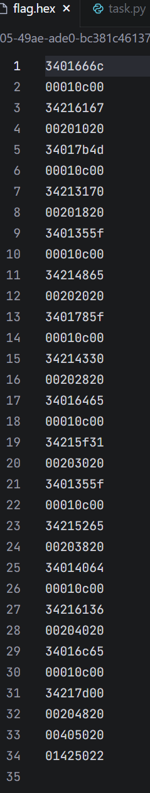

5、 仔细观察发现其中有 16 进制码，可是又有点奇怪，通
过观察数值特征（如 3401、0020 等频繁出现），我
们将前几行数据放入 MIPS 反汇编器中观察其指令逻
辑

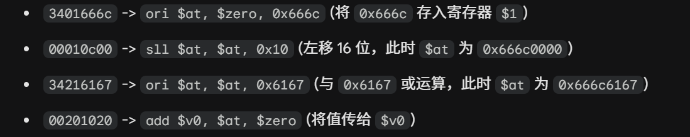

6、 代码通过 ori 和 sll 指令，不断地将两个 16 位的十
六进制数拼接成一个 32 位的字（Word），然后存入
内存或寄存器。每一个 32 位的字实际上包含了 4 个 
ASCII 字符。 
7、 字符从指令中提取出被操作的立即数（即每段的前 4 
位之后的部分）： 

```text
66 6c / 61 67 -> 666c6167 
7b 4d / 31 70 -> 7b4d3170 
35 5f / 48 65 -> 355f4865 
78 5f / 43 30 -> 785f4330 
64 65 / 5f 31 -> 64655f31 
35 5f / 52 65 -> 355f5265 
40 64 / 61 36 -> 40646136 
6c 65 / 7d 00 -> 6c657d00
```

8、将上述十六进制序列转换为字符串： 

```text
66 6c 61 67 -> flag 
7b 4d 31 70 -> {M1p 
35 5f 48 65 -> 5_He 
78 5f 43 30 -> x_C0 
64 65 5f 31 -> de_1 
35 5f 52 65 -> 5_Re 
40 64 61 36 -> @da6 
6c 65 7d -> le} 
```

得到完整的 Flag： 

```text
flag{M1p5_Hex_C0de_15_Re@da6le} 
```

## Reverse 

### Teapot 

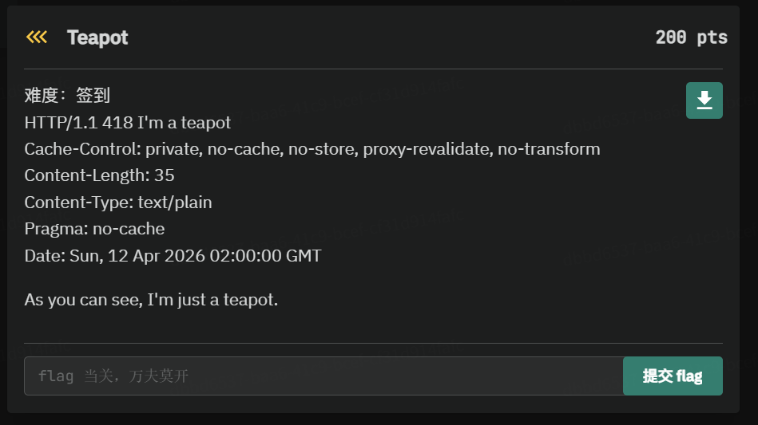

思路：1、下载附件后，先检查是否有壳，用 exeinfope 发
现无壳，再拖入 ida 

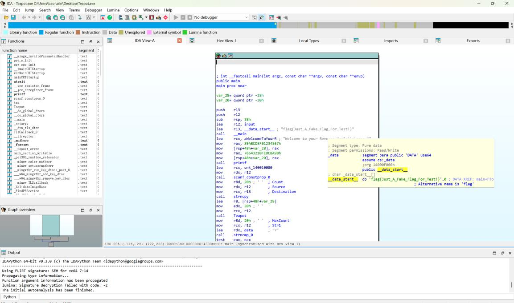

2、第一眼发现一个 flag，尝试过后发现错误，原来是个障
眼法。 
3、算法判断，Teapot 这个函数，有这些特征： 
32 轮循环、常数 0x9e3779b9、移右移混合运算，再根据
题目提示，基本可以确定为 TEA 加密 
程序流程如下：输入字符串 input 、用函数： 
Teapot(input, 32, v4)、加密后的 input 与 .data 段中的 
data 比较： 

```c
if (!strncmp(input, data, 0x20u)) 
```

即： 
对输入进行加密，若结果等于 data 则通过校验。

4、发现关键数据 

```text
v4[0] = 0x89ABCDEF01234567; 
v4[1] = 0x76543210FEDCBA98; 
```

这其实就是咱想找的 key， 
拆成： 

```python
k = [0x01234567, 0x89ABCDEF, 0xFEDCBA98, 0x76543210] 
```

5、找密文，也就是 data， 
从 .data 里抄前 32 字节： 

```python
cipher = bytes([ 
0x59,0x0C,0xEE,0x3D,0x4C,0x5B,0xE2,0xE8, 
0x97,0xF7,0xEF,0x5C,0xFA,0xD3,0x6F,0xB9, 
0x03,0xBF,0x31,0x5A,0x80,0xD2,0xF1,0x61, 
0xD9,0x2F,0xC3,0x79,0x9A,0x91,0xDE,0x30 
]) 
```

6、编写解密脚本 

```python
import struct 
 
def tea_decrypt(v, k): 
    v0, v1 = v
    delta = 0x9e3779b9 
    s = (delta * 32) & 0xffffffff 
 
    for _ in range(32): 
        v1 = (v1 - (((v0 << 4) + k[2]) ^ (v0 + s) ^ ((v0 >> 5) + k[3]))) & 0xffffffff 
        v0 = (v0 - (((v1 << 4) + k[0]) ^ (v1 + s) ^ ((v1 >> 5) + k[1]))) & 0xffffffff 
        s = (s - delta) & 0xffffffff 
 
    return v0, v1 
 
 
k = [0x01234567, 0x89ABCDEF, 0xFEDCBA98, 0x76543210] 
 
cipher = bytes([ 
    0x59, 0x0C, 0xEE, 0x3D, 0x4C, 0x5B, 0xE2, 0xE8, 
    0x97, 0xF7, 0xEF, 0x5C, 0xFA, 0xD3, 0x6F, 0xB9,
    0x03, 0xBF, 0x31, 0x5A, 0x80, 0xD2, 0xF1, 0x61, 
    0xD9, 0x2F, 0xC3, 0x79, 0x9A, 0x91, 0xDE, 0x30 
]) 
 
res = b"" 
for i in range(0, len(cipher), 8): 
    v0, v1 = struct.unpack("<2I", cipher[i:i + 8])
    d0, d1 = tea_decrypt((v0, v1), k) 
    res += struct.pack("<2I", d0, d1) 
 
print(res.decode(errors="ignore")) 
```

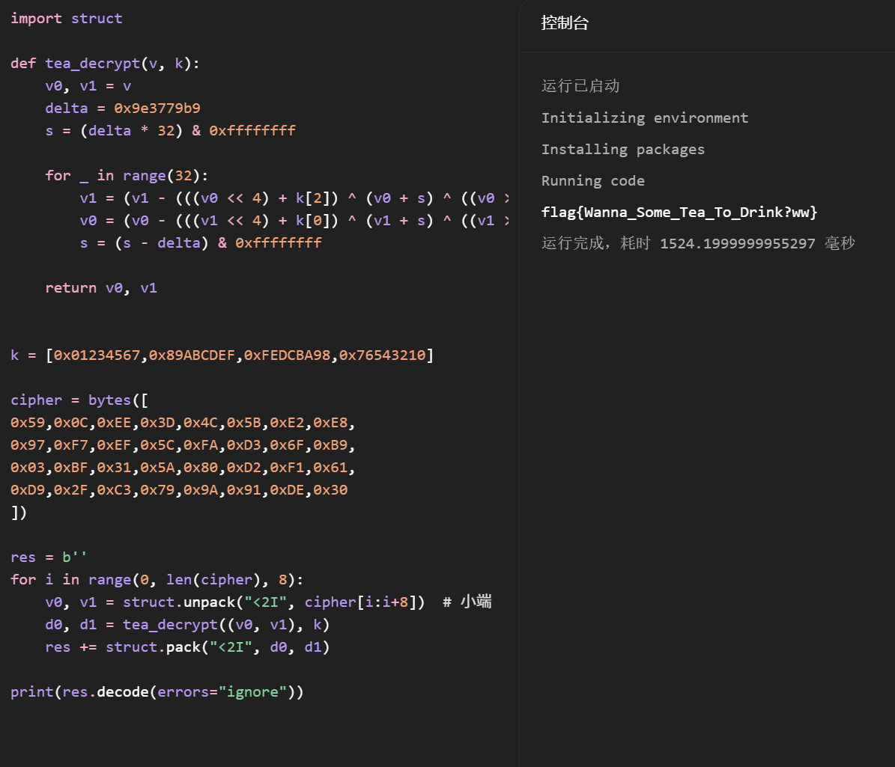

8、 运行后得到 flag 为

```text
flag{Wanna_Some_Tea_To_Drink?ww} 
```

